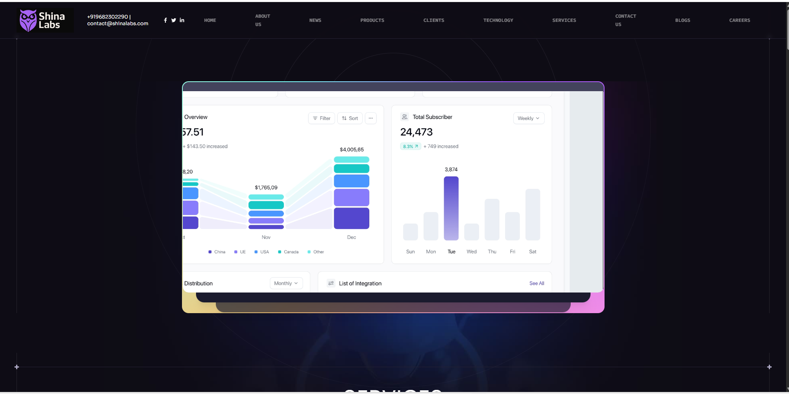

# 🌐 Shina Labs Website

Welcome to the official repository for the **Shina Labs** website — a modern, responsive, and performance-driven digital presence built to showcase our services, innovations, and expertise across multiple industries.


---

## 🚀 Project Overview

The Shina Labs site is designed to:
- Highlight our services in Software Development, Data Science, Digital Marketing, UI/UX, and more
- Showcase milestones, testimonials, and industries we’ve worked with
- Provide a sleek user interface optimized for both desktop and mobile

---

## 🛠️ Tech Stack

- **React.js** (Vite)
- **Tailwind CSS**
- **React Slick** (Slider)
- **React Parallax** (Scroll & Mouse-based parallax)
- **Framer Motion** (for optional animations)
- **EmailJS / Form handling** (for contact form)
- **Responsive design** using `flex`, `grid`, and custom media queries

---

## 📁 Folder Structure (Simplified)

├── public/
│ └── index.html
├── src/
│ ├── assets/
│ ├── components/
│ ├── sections/
│ ├── App.jsx
│ └── main.jsx

yaml
Copy
Edit

---

## 🖼️ Image Usage

To include the image you uploaded (`087e95f3-464d-4801-91c4-e1e68b145942.png`), place it in a folder like `assets` and reference it as shown:

```markdown

Or rename it for clarity:

bash
Copy
Edit
mv 087e95f3-464d-4801-91c4-e1e68b145942.png shina-labs-preview.png
📦 Installation
bash
Copy
Edit
npm install
npm run dev
🌍 Live Preview
Coming soon: https://shinalabs.com

📬 Contact
📧 Email: contact@shinalabs.com
📞 Phone: +91 96823 02290
🔗 LinkedIn: Shina Labs

🪪 License
This project is licensed under the MIT License.